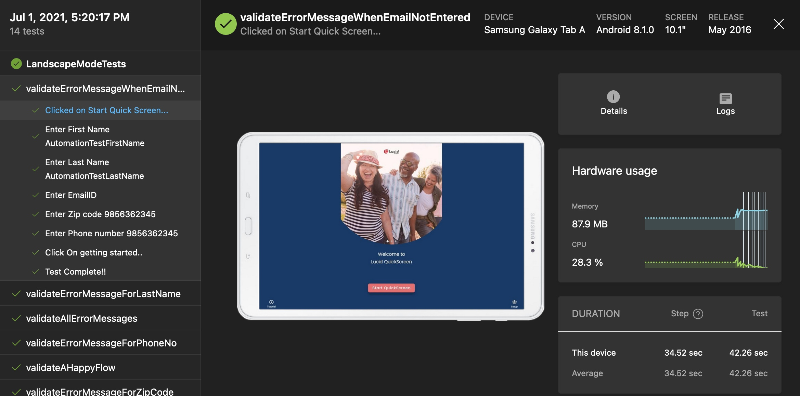

# **lucid-hearing-automation-tests**

___

Appium test automation framework to validate functional workflows are working as expected. These tests are run against every new .apk file has been created.

___

## **Tools**
1. Maven as a project build tool. [Here](https://maven.apache.org/install.html) is how to install maven
2. Android studio (this is required to install an android tablet emulator on a local machine). [Here](https://developer.android.com/studio?gclid=CjwKCAjwz_WGBhA1EiwAUAxIcUP-RjKXiDNXPRpEQNuZCfx8Q_VY5TdUN_XhOr5lEWyIfw9P_m7X5hoC1t8QAvD_BwE&gclsrc=aw.ds) is the installation process.
3. Appium server tool to spawn the .apk file in the emulator. [Here](https://appium.io/docs/en/about-appium/getting-started/?lang=en) is how to install. OR if you have nodeJS installed you can use the command `npm install -g appium` to install it globally.
4. IntelliJ IDEA to execute test case on your local machine. [Here](https://www.jetbrains.com/help/idea/installation-guide.html#toolbox) community edition is good enough 

___

## **Concepts Included**
___

We are using Microsoft app center's [discipline](https://docs.microsoft.com/en-us/appcenter/test-cloud/frameworks/appium/) to write automation cases   

1. Page Object Pattern.
2. Maven to upload tests to microsoft app center.
3. App center cli to run tests on various devices configured on app center. To install app center cli, [here](https://docs.microsoft.com/en-us/appcenter/cli/) is the document to install. (This will be required to upload tests on app center from local machine)   
___ 

## **To Upload tests to app center from local**

1. Login to app center will take you to the following screen.
   
2. Click on New test run, if not it will ask you to configure a specific device, select the devices you want to run your tests on (See-screenshot) 
   
3. Click on launch test and appium as our test framework and click Next (see screen-shot) 

4. This page will give you detailed commands to run from CLI also you need to specify the .apk file path (ensure maven and appcenter are installed) .

5. Sample Results 
___

## **Run test cases locally on an emulator**

1. Ensure you have an emulator tablet running on local system you can do it from Android Studio 
   (Tools -> AVD Manager -> select emulator device)
2. Keep your appium server running.
3. Specify .apk file path to the TestBaseClass (see-screenshot) 
4. Right click on any test case and say run (see-screen shot) 
